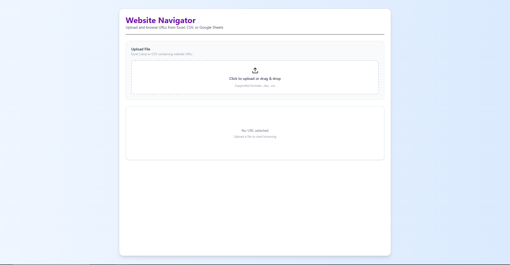
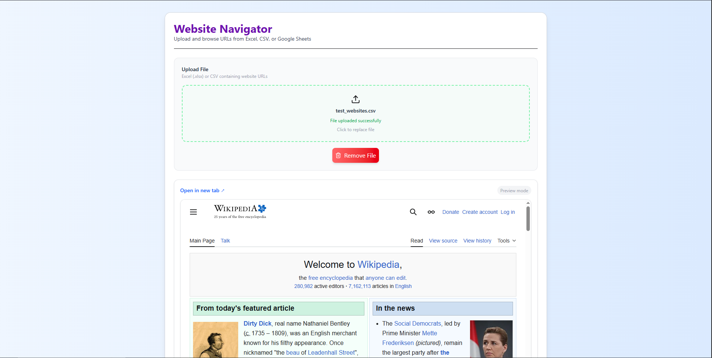
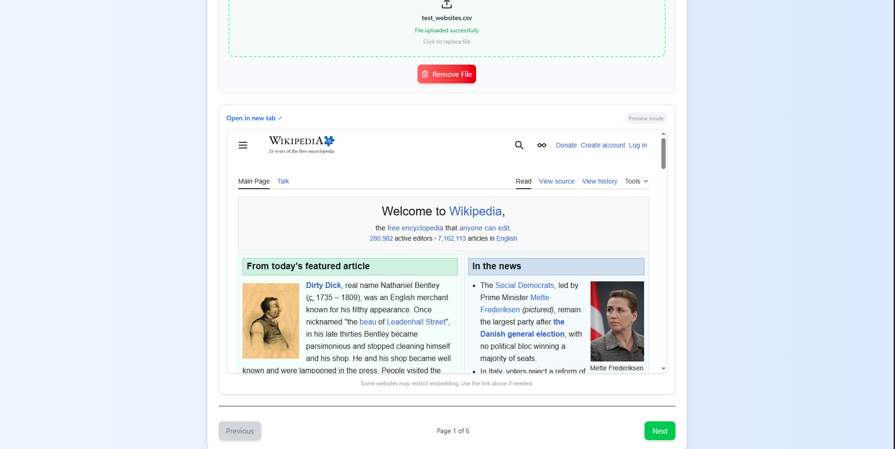

# Website Viewer

## Overview

Website Viewer is a full-stack application that allows users to upload Excel, CSV, or Google Sheets data containing website URLs and navigate through them seamlessly within the app.

It focuses on **data extraction, validation, and smooth user navigation**, while handling real-world constraints like iframe restrictions.

---

## Features

### File Upload

- Supports `.xlsx` and `.csv` files
- Extracts URLs from **any column** (not just first)
- Handles messy data gracefully

### URL Navigation

- Browse websites using **Next / Previous controls**
- Displays current position (e.g., `2 / 10`)

### Website Viewer

- Loads websites inside an iframe
- Provides **“Open in new tab” fallback** for blocked sites

### Smart Handling

- Filters invalid URLs
- Removes duplicates
- Handles empty or incorrect files

### UX Enhancements

- Shows uploaded file name
- Remove/reset file option
- Loading states & error feedback
- Clean, minimal UI

---

## Screenshots

### Home Page



### File Upload



### URL Navigation




- React + TypeScript
- Vite
- Tailwind CSS

### Backend

- Node.js + Express
- TypeScript
- Multer (file uploads)
- xlsx (Excel/CSV parsing)

---

## How It Works

```text
Upload File → Backend parses → URLs extracted → Sent to frontend → Navigate + View.
```

## Installation and Setup

1. Clone the repository:

   ```bash
   git clone <repository-url>
   cd Website Viewer
   ```

2. Install dependencies for both client and server:

   ```bash
   cd client
   npm install
   cd ../server
   npm install
   ```

3. Start the development servers:
   - Client:
     ```bash
     cd client
     npm run dev
     ```
   - Server:
     ```bash
     cd server
     npm run dev
     ```

4. Open the application in your browser:
   - Client: `http://localhost:5173`
   - Server: `http://localhost:3000`

## Folder Structure

- **Client**:
  - `src/components`: React components like `FileUpload`, `Navigation`, etc.
  - `src/services`: API service for client-server communication.
  - `src/utils`: Utility functions like `validateUrl`.

- **Server**:
  - `src/controllers`: Handles business logic for routes.
  - `src/middleware`: Middleware for handling uploads.
  - `src/routes`: Defines server routes.
  - `src/utils`: Utility functions for URL validation and extraction.

## Assumptions and Design Decisions

### iFrame Limitations

Some websites block embedding via headers like `X-Frame-Options`.

**Solution**: Provide an “Open in new tab” fallback for such cases.

### File Handling Assumptions

- URLs can exist in any column of the uploaded file.
- Invalid or non-URL values are ignored.
- Duplicate URLs are removed.

### Design Decisions

- The backend handles parsing instead of the frontend to ensure scalability.
- Validation is performed on both the frontend and backend.
- The UI is kept minimal with a focus on usability.
- Avoided overengineering by not including a database.

## License

This project is licensed under the MIT License.
# WebsiteViewer
